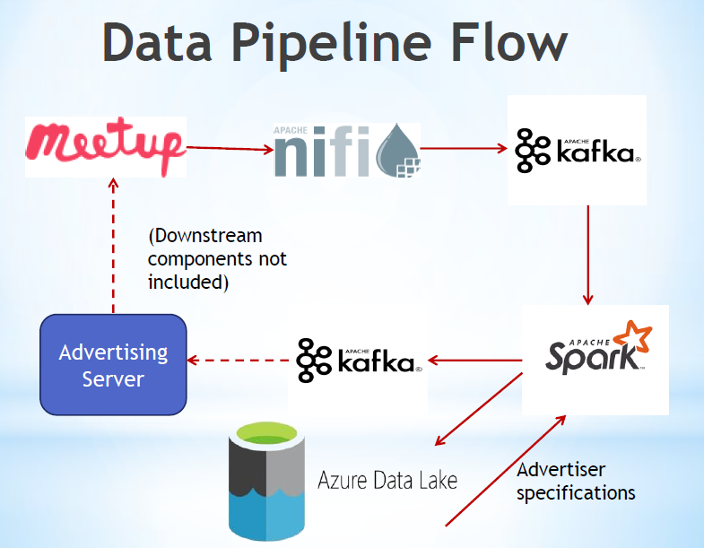
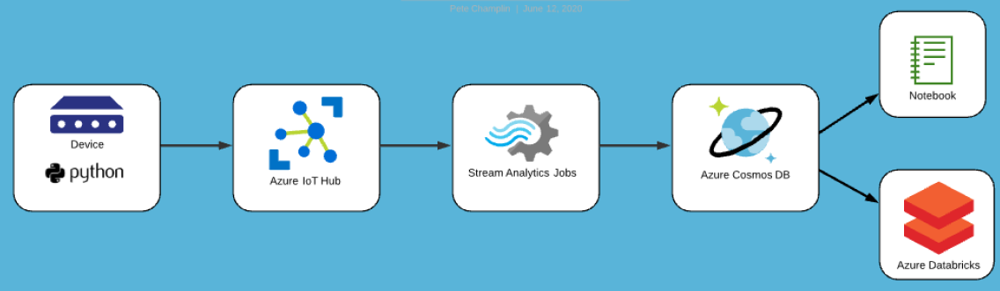

# UW-Big-Data-Technology

In June 2020 I completed a certificate program in Big Data Technology through the University of Washington (https://www.pce.uw.edu/certificates/big-data-technologies).

Most exercises were done using Spark through Azure Databricks (in both Python and Scala), while also including such big data tools as Kafka, NiFi, Docker, Azure Data Lake, Azure Event Hub, CosmosDB, and Delta Lake, and also machine learning tools scikit-learn, keras, and MLFLow.

The program consisted of three 10 week quarters. I've included several assignment files (mostly Notebooks), indicating which academic quarter the assigment was from (Q1, Q2,  or Q3).

Below are a couple data flow diagrams from Q2 (Streaming) and Q3 (IoT) assignments:

